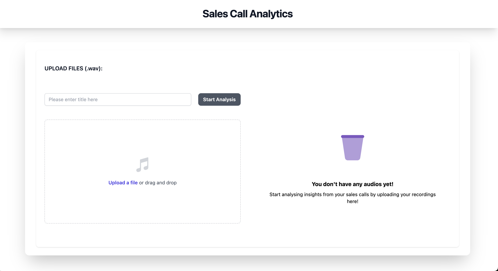

# Sales call analytics dashboard

=====================

This README provides instructions and information for setting up and running the React frontend application for sales call analytics. The application interacts with AWS S3 for file storage and a backend API for data retrieval and processing.



## Prerequisites

---

Before running the React frontend, ensure you have the following prerequisites installed:

- Node.js and npm: Make sure you have Node.js and npm installed on your machine. You can download and install them from the [official Node.js website](https://nodejs.org/).

## Getting Started

---

Follow these steps to set up and run the React frontend:

1.  **Clone the Repository:**

    Clone the repository containing the React frontend code to your local machine.

    `git clone <repository-url>`

2.  **Install Dependencies:**

    Navigate to the project directory and install the required dependencies using npm.

    `cd <project-directory> npm install`

3.  **Configuration:**

    Set up the necessary environment variables for the application. Create a `.env` file in the root directory of the project and add the following environment variables:

    ```
    REACT_APP_AWS_ACCESS_KEY=<Your AWS Access Key>
    REACT_APP_AWS_SECRET_KEY=<Your AWS Secret Key>
    REACT_APP_AWS_REGION=<Your AWS Region>
    REACT_APP_AWS_S3_BUCKET=<Your AWS S3 Bucket Name>
    REACT_APP_API_BASE=http://localhost:8000/
    ```

    Replace `<Your AWS Access Key>`, `<Your AWS Secret Key>`, `<Your AWS Region>`, and `<Your AWS S3 Bucket Name>` with your actual AWS credentials and S3 bucket information.

4.  **Run the Application:**

    Once the dependencies are installed and the environment variables are configured, you can start the React development server.

    `npm start`

    This command will start the development server and open the application in your default web browser.

5.  **Accessing the Application:**

    You can access the React frontend application by visiting `http://localhost:3000` in your web browser.

## Additional Information

---

- **API Configuration:** The frontend expects the backend API to be running at `http://localhost:8000/`. Make sure the backend server is up and running before using the frontend application.
- **AWS S3 Integration:** The application interacts with AWS S3 for file storage. Ensure that your AWS credentials have appropriate permissions to access the specified S3 bucket.
- **Development Mode:** The application runs in development mode by default. For production deployment, you may need to configure additional settings and build the application accordingly.

## Troubleshooting

---

If you encounter any issues during setup or while running the application, please refer to the documentation provided by React and the libraries used in the project. Additionally, check your environment variables and ensure they are correctly set up.

If you have any questions or need further assistance, please don't hesitate to reach out to the project maintainers.

## Contribution Guidelines

Contributions to the repository are welcome. If you find any issues or would like to add new features, please follow these guidelines:

- Fork the repository and create a new branch for your feature or bug fix.
- Ensure that your code follows PEP 8 style guidelines.
- Submit a pull request with a clear description of the changes you have made.

[Contribution Guidelines](CONTRIBUTING.md).

## License

This project is licensed under the [MIT License](LICENSE).

## Contact

For any questions or inquiries, please contact [meghamgarg@gmail.com](mailto:meghamgarg@gmail.com).
